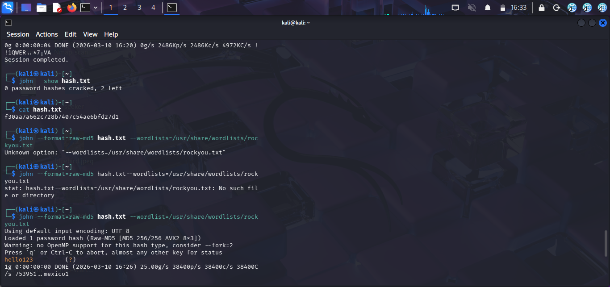
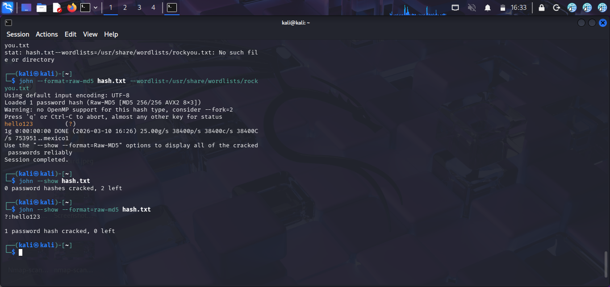

# Password Cracking Lab

## Overview
This project demonstrates how weak passwords can be cracked from hashed values using John the Ripper in Kali Linux.

The goal of this lab is to understand how cybersecurity professionals test password strength using dictionary attacks.

---

## Tools Used

- Kali Linux
- John the Ripper
- rockyou.txt wordlist

---

## Lab Steps

### Step 1 – Create Password

Password used for this lab:

hello123

---

### Step 2 – Generate Hash

Command used:

echo -n "hello123" | md5sum

Generated hash:

f30aa7a662c728b7407c54ae6bfd27d1

---

### Step 3 – Save the Hash

Create a file:

nano hash.txt

Paste the hash into the file.

---

### Step 4 – Crack the Password

Run the command:

john --format=raw-md5 hash.txt --wordlist=/usr/share/wordlists/rockyou.txt

---

### Step 5 – Show the Cracked Password

Command used:

john --show --format=raw-md5 hash.txt

Result:

hello123

---

## Results

| Hash | Cracked Password |
|-----|-----|
| f30aa7a662c728b7407c54ae6bfd27d1 | hello123 |

---

## Lessons Learned

- Weak passwords can be cracked quickly
- Dictionary attacks are effective
- Strong passwords should be used in real systems

---

## Conclusion

This lab demonstrates how password cracking works and why strong password policies are important in cybersecurity.

## Screenshots

### Hash creation and Passowrd creation

### Cracked Password

