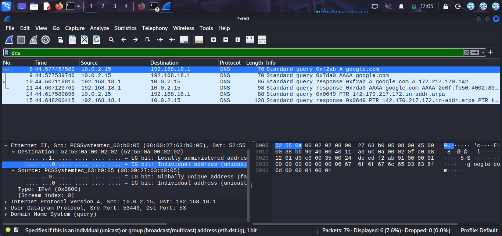

# Wireshark Packet Analysis

## Objective
Capture and analyze DNS traffic using Wireshark.

## Tools Used
- Wireshark
- Kali Linux

## Command Used
ping google.com

## Findings
A DNS query was captured when the system attempted to resolve the domain google.com.

Source IP: 10.0.2.15  
Destination IP: 192.168.18.1  
Protocol: DNS  
Destination Port: 53  

This confirms that DNS requests were sent to resolve the domain name.

## Evidence

## Conclusion
The packet capture demonstrated how DNS queries are generated and transmitted across the network when resolving domain names.
